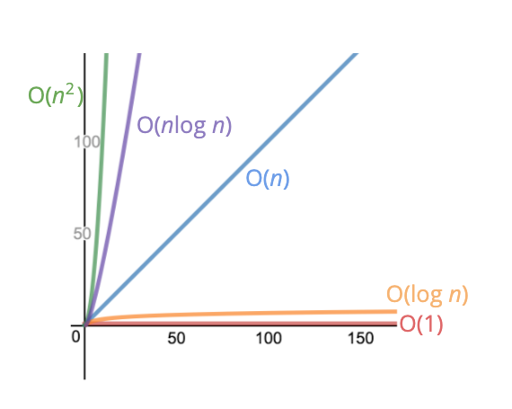

# ~ 4월 3일

## (빅오 표기법) Big O Notation

입력 데이터의 크기에 따른 알고리즘의 효율성(성능)을 표기한다. 빅오 표기법은 정확도보다는 전체적인 추세(general trends)를 중요하게 생각한다. 상수의 형태가 제일 간단하고 로그, 선형, 다차 형태.. 등의 순서로 복잡해진다. ``O(1), O(log n), O(n), O(n log n), O(n^2), O(n^3)``
### 시간 복잡도
어떤 알고리즘을 수행하는 데에 걸리는 시간. 입력 데이터의 크기에 따라 얼마나 많은 계산을 수행하는지를 **최고차항**으로 판단한다.
### 공간 복잡도
알고리즘이 메모리를 얼마나 사용하는지.
``Boolean, Number, undefined, null``은 상수의 공간임으로 O(1)이다. ``string``의 경우는 문자열의 length가 길어질수록 그만큼의 공간이 필요하므로 O(n)이다. ``Array, Object``도 마찬가지로 선형의 형태이다.
### (참고)로그?
왼쪽은 로그형식, 오른쪽은 지수형식

``log2(8) = 3 ⟺ 2의 3승 = 8``

빅오 표기법에서는 이진로그이든 십진로그이든 log라고 표기한다.